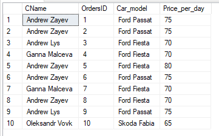
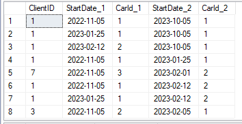
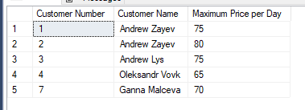
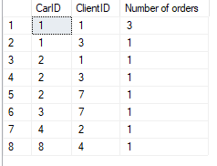
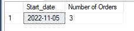
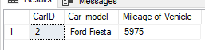
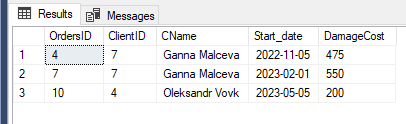
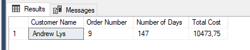
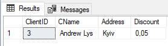
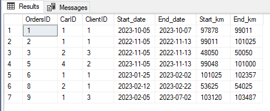

23. Вивести інформацію про замовлення у форматі: ПІБ клієнта, номер замовлення, марка авто, вартість прокату за добу.

```
SELECT Client.CName, 
	Orders.OrdersID, 
	Car.Car_model, 
	Car.Price_per_day 
FROM Orders
	INNER JOIN Client ON Client.ClientID = Orders.ClientID
	INNER JOIN Car ON Car.CarID = Orders.CarID;
```


24. Вивести інформацію про пари замовлень одного клієнта у форматі: номер клієнта, дата початку прокату та номер авто № 1, дата початку прокату та номер авто № 2.

```
SELECT O1.ClientID,
	O1.Start_date AS StartDate_1, 
	O1.CarID AS CarId_1, 
	O2.Start_date AS StartDate_2, 
	O2.CarID AS CarId_2
FROM Orders O1 
	INNER JOIN Orders O2 ON O1.ClientID = O2.ClientID
WHERE O1.OrdersID <> O2.OrdersID
	AND O1.Start_date < O2.Start_date;
```


25. Вивести інформацію про замовлення у форматі: номер клієнта, ПІБ клієнта, максимальна ціна за добу його замовлення.
```
SELECT c.ClientID AS 'Customer Number',
	c.CName AS 'Customer Name',
    MAX(car.Price_per_day) AS 'Maximum Price per Day'
FROM Client c
	INNER JOIN Orders o ON c.ClientID = o.ClientID
	INNER JOIN Car car ON o.CarID = car.CarID
GROUP BY c.ClientID, c.CName;
```


26. Вивести статистику у форматі: номер авто, номер клієнта, кількість замовлень на цю машину у клієнта
```
SELECT Orders.CarID, 
	Orders.ClientID, 
	COUNT(ClientID) AS 'Number of orders'
FROM Orders
GROUP BY Orders.CarID, Orders.ClientID
ORDER BY Orders.CarID;
```


27. Для кожної дати порахувати кількість замовлень у цей день, та вивести, якщо кількість більша або дорівнює 2. Вивести у форматі: дата початку прокату, кількість замовлень
```
SELECT Orders.Start_date, 
	COUNT(Orders.Start_date) 'Number of Orders'
FROM Orders
GROUP BY Orders.Start_date
HAVING COUNT(Orders.Start_date) >= 2;
```


28. Для кожної машини знайти сумарний пробіг за всі оренди та вивести, якщо ця кількість більша за 5000 км.
```
SELECT Orders.CarID, Car.Car_model, SUM(Orders.End_km - Orders.Start_km) 'Mileage of Venicle'
FROM Orders
INNER JOIN CAR ON CAR.CarID = Orders.CarID
GROUP BY Orders.CarID, 
	Car.Car_model
HAVING SUM(Orders.End_km - Orders.Start_km) > 5000
```


29. Вивести інформацію про замовлення у форматі: номер замовлення, номер та ПІБ клієнта, дата початку замовлення, сума пошкоджень; вивести, якщо сума більша за 2000.
```
SELECT DISTINCT Orders.OrdersID,
	Orders.ClientID,
	Client.CName,
	Orders.Start_date,
	SUM(Damage.Price + Jobs.Cost) DamageCost
FROM Orders
INNER JOIN Client ON Orders.ClientID = Client.ClientID
INNER JOIN Damage ON Orders.OrdersID = Damage.OrdersID
INNER JOIN Jobs ON Damage.DamageID = Jobs.DamageID
GROUP BY Orders.OrdersID,
	Orders.ClientID,
	Client.CName,
	Orders.Start_date
HAVING(SUM(Damage.Price + Jobs.Cost)) > 2000;
```
Відповідь буде порожній результат, бо:



30. Вивести інформацію про замовлення клієнтів з Києва у форматі: ПІБ клієнта, номер замовлення, кількість днів замовлення, сумарна вартість замовлення; вивести, якщо сума більша за 1000.
```
SELECT c.CName AS 'Customer Name',
       o.OrdersID AS 'Order Number',
       DATEDIFF(day, o.Start_date, o.End_date) AS 'Number of Days',
       (DATEDIFF(day, o.Start_date, o.End_date) * (1 - c.Discount) * car.Price_per_day) AS 'Total Cost'
FROM Orders o
JOIN Client c ON o.ClientID = c.ClientID
JOIN Car car ON o.CarID = car.CarID
WHERE c.Address LIKE '%Kyiv%'
    AND (DATEDIFF(day, o.Start_date, o.End_date) * (1 - c.Discount) * car.Price_per_day) > 1000;
```


31. Вивести клієнта з мінімальною знижкою.
```
SELECT *
FROM Client
WHERE Client.Discount = (SELECT MIN(Client.Discount) FROM Client);
```


32. Вивести інформацію про замовлення, що пройшли без ушкоджень.
```
SELECT Orders.*
FROM Orders
LEFT JOIN Damage ON Damage.OrdersID = Orders.OrdersID
WHERE Damage.OrdersID IS NULL;
```

