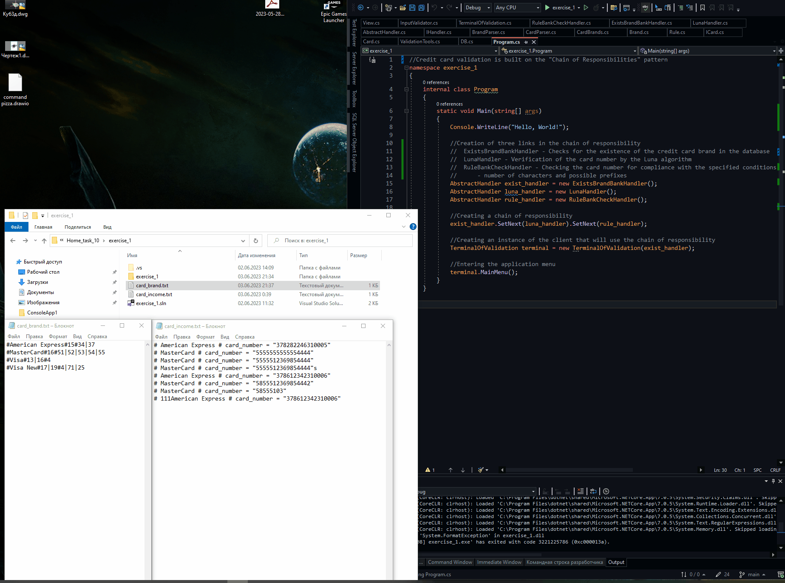
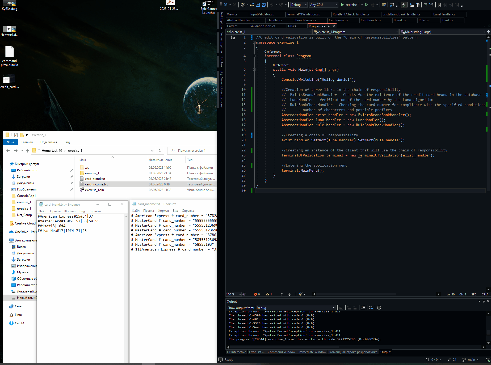

## Опис запропонованого рішення
Для валідації кредитних карт створено наступну програму. Клас ```class Card : ICard``` який зберігає в собі назва бренду картки і її номер. Дані про бренд картки і її правила зберігаються в класі ```class Brand : IEquatable<Brand>```, який зберігає назву бренду і правила ```class Rule : IEquatable<Rule>``` (які потрібно перевірити для кожної введеної картки).
Дані про зареєстровані бренди зберігаються в текстовому файлі ```card_brand.txt```. Картки для перевірки зберігаються в файлі ```card_income.txt```. Для роботи з файлами використовується клас ```static class DB```.
Для парсингу інформації про картки і бренду використовується клас ```static class CardParser``` і ```static class BrandParser```.

Валідація картки виконується за патерном Ланцюг Обов'язків. Створено три ланки ланцюга які наслідують абстрактний клас який імплементує інтерфейс ```abstract class AbstractHandler : IHandler```:
- ```class LunaHandler : AbstractHandler``` - валідує на алгоритм Луна;
- ```class ExistsBrandBankHandler : AbstractHandler``` - валідує чи бренд картки зареєстрований;
- ```class RuleBankCheckHandler : AbstractHandler``` - валідує чи проходить картка правила бренду.

Кожна ланка ланцюга використовує методи для валідації які виконані в класі ```static class ValidationTools```:
- ```public static bool LunaCheckCard(string card_number)``` - валідує на алгоритм Луна;
- ```public static bool CheckCardBrand(string card_brand)``` - валідує чи бренд картки зареєстрований;
- ```public static bool CheckCardRule(string card_brand, string card_number)``` - валідує чи проходить картка правила бренду.

Під час роботи програми дані про зареєстровані бренди зберігаються і обробляються в класі ```static class CardBrands```.

Взаємодія з користувачем організована класом ```class TerminalOfValidation```.
Валідація вхідних даних про картки і бренди виконує класс ```static class InputValidator```.
Вивід інформації про роботу програми виконує клас ```static class View```.

Вміст файлу ```card_income.txt```:
```
# American Express # card_number = "378282246310005"        ---- валідна
# MasterCard # card_number = "5555555555554444"             ---- валідна
# MasterCard # card_number = "5555512369854444"             ---- не пройшла валідацію по Луна
# MasterCard # card_number = "5555512369854444"s            ---- не відповідає формату введення
# American Express # card_number = "378612342310006"        ---- валідна
# MasterCard # card_number = "5855512369854442"             ---- не пройшла валідацію по параметрам бренду
# MasterCard # card_number = "58555103"                     ---- не пройшла валідацію по параметрам бренду
# 111American Express # card_number = "378612342310006"     ---- не пройшла валідацію по перевірці бренду
```

Вміст файлу ```card_brand.txt```:
```
#American Express#15#34|37
#MasterCard#16#51|52|53|54|55
#Visa#13|16#4
#Visa New#17|19#4|71|25
```

## Демонстрація роботи
### Обробка з файлу і з консолі, додавання ного типу картки. Перевірка на введення в некоректному форматі, перевірка карт по 3-м параметрам



### Введення даних з пропусками
