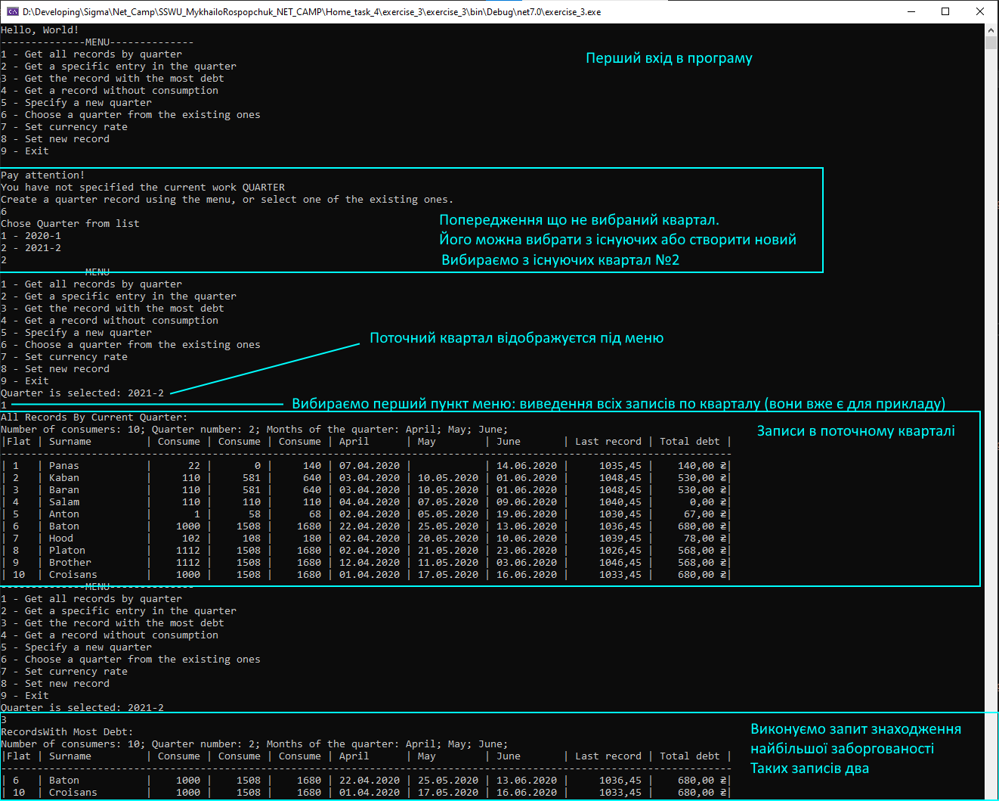
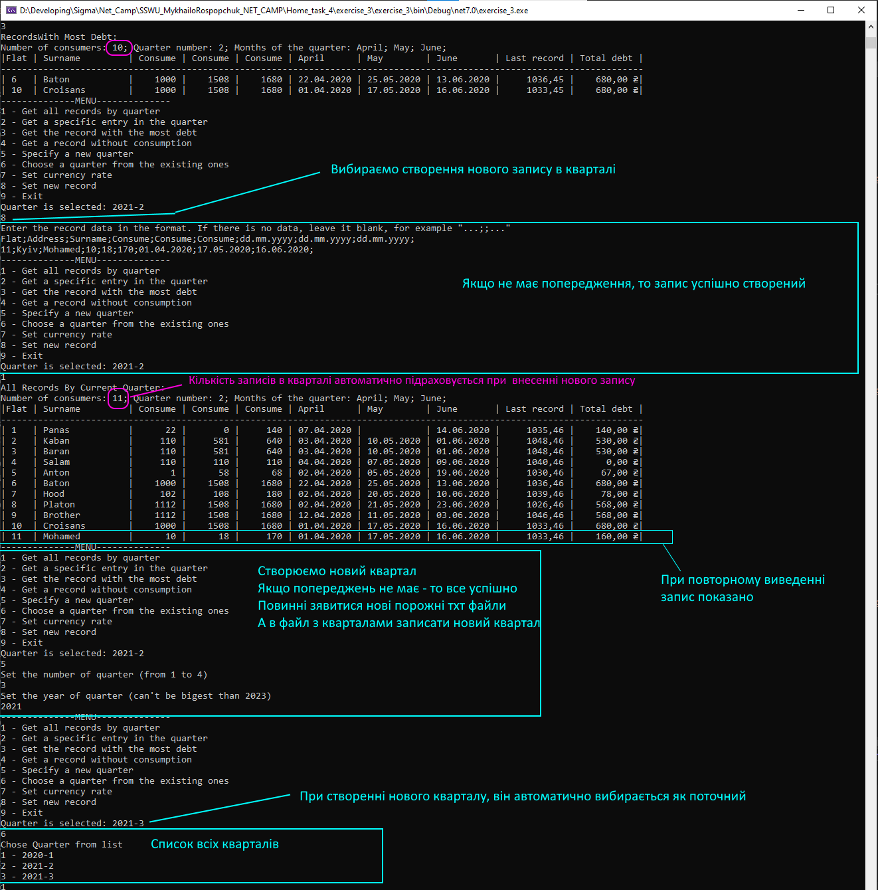
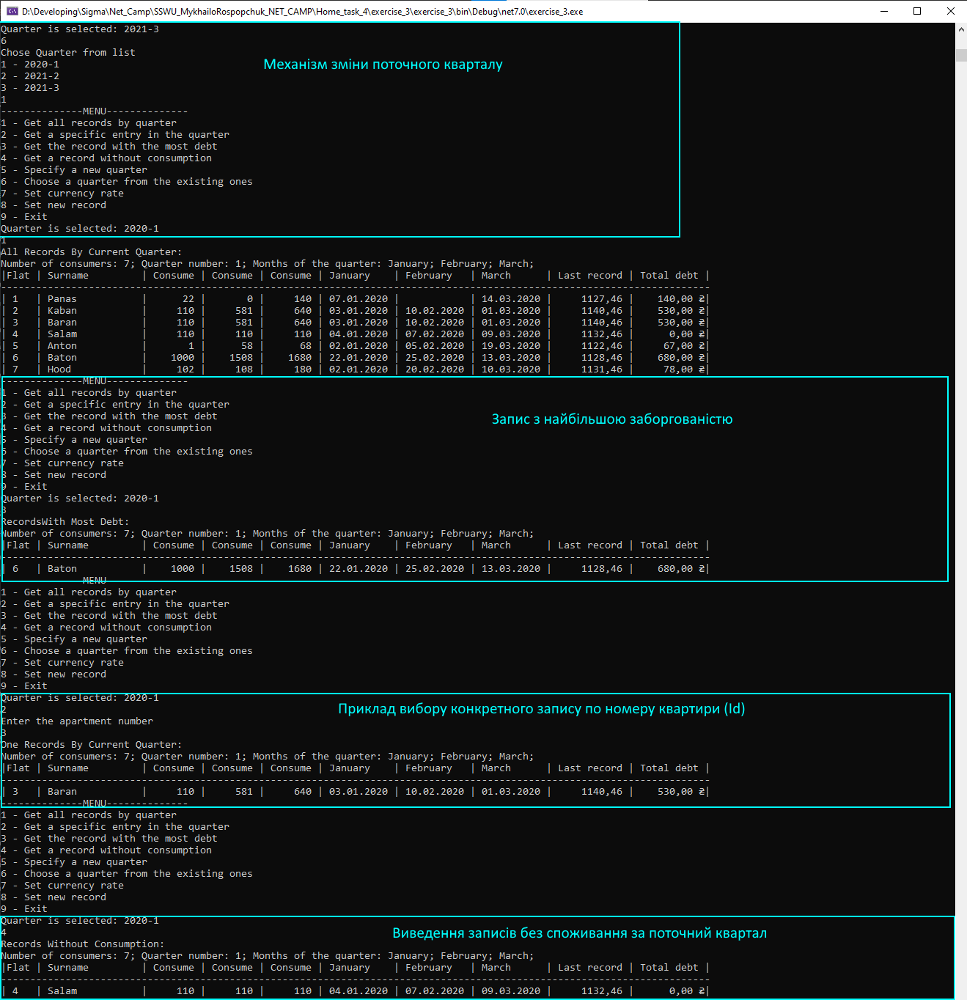
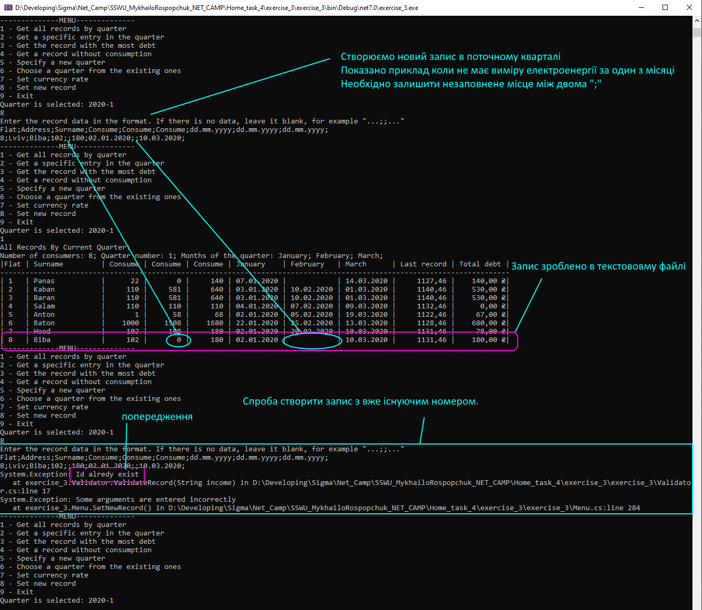
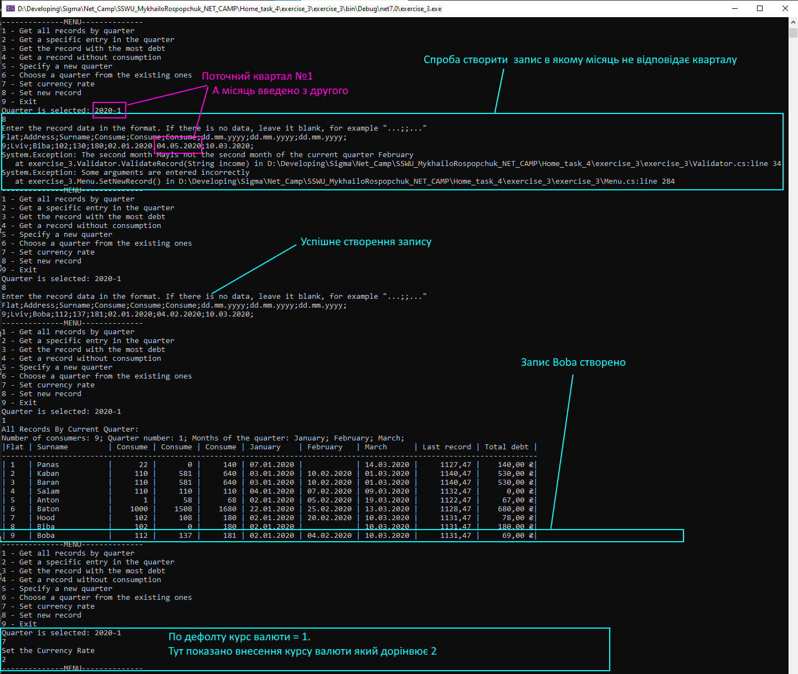
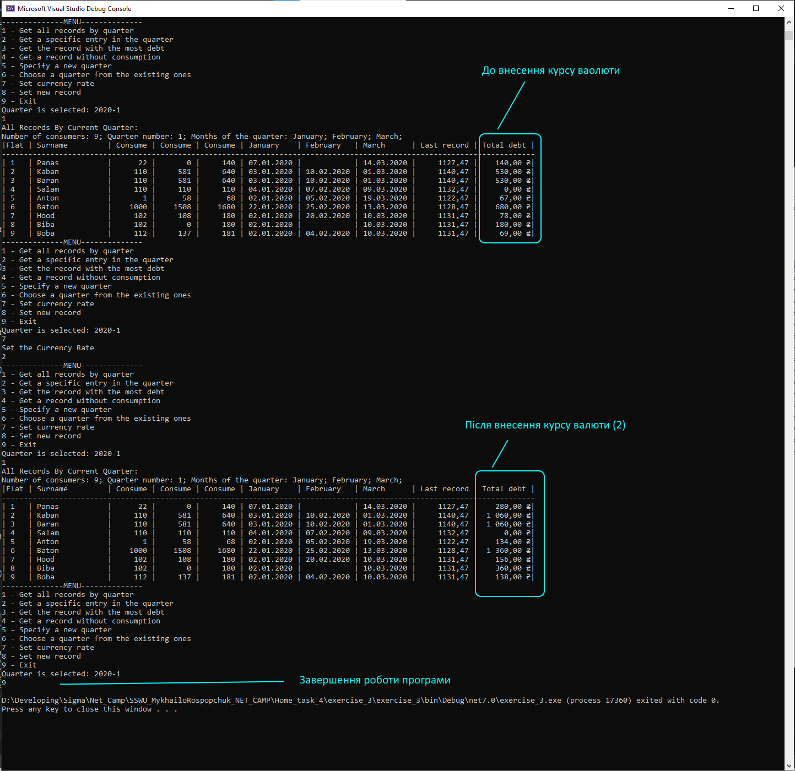
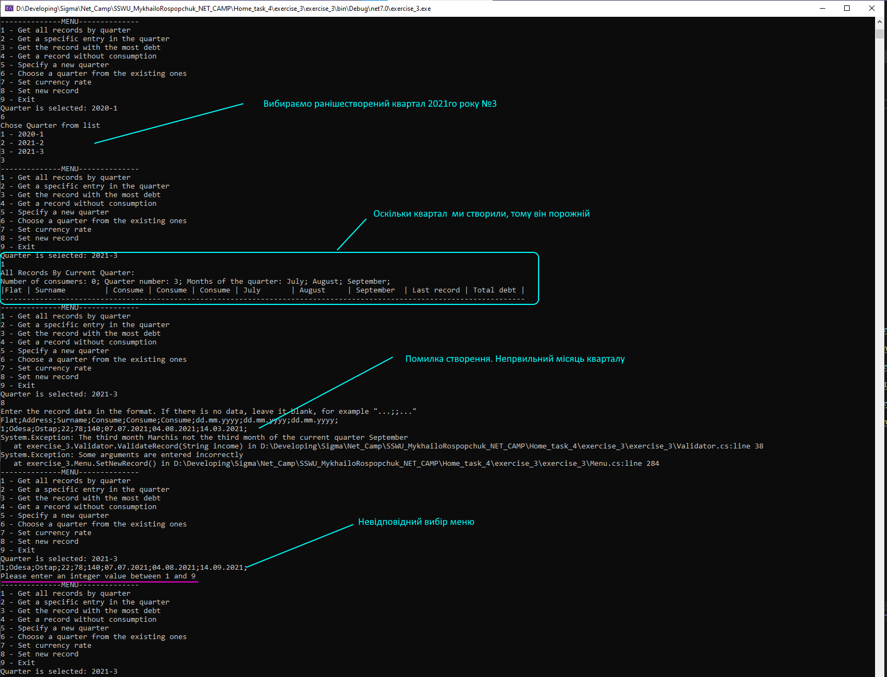
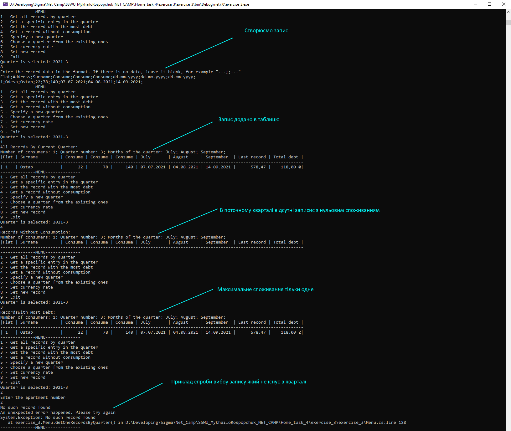
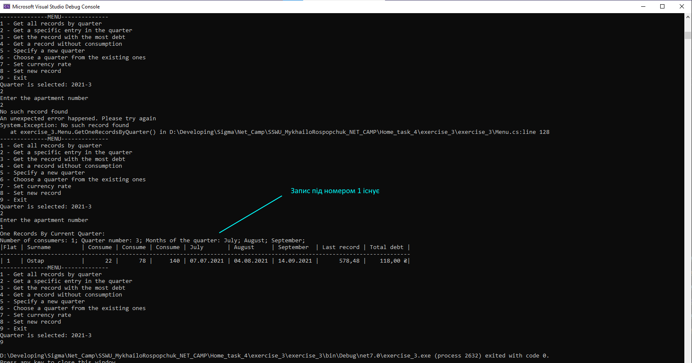

## Опис
### Вихідний стан програми в репозиторії
В програму внесено три квартали, разом з даними (6 робочих файлів з даними і один "системний").

### Функціонал роботи
Всі дані зберігаються в текстових файлах. При роботі програми використовують три типи файлів.

system_path.txt -  використовується для зберігання створених кварталів.
При виході з програми і повторному запуску, програма зчитує дані про раніше створені квартали.
Якщо це перший запуск то такий файл створиться автоматично. При створенні кварталу, в файл записується інформація про квартал в форматі <рік-квартал> (наприклад 2020-1 - 2020 рік 1й квартал).
Інформація про квартал в подальшому використовується для створення файлів які безпосередньо будуть містити дані по записам кварталу.
При видаленні файлу, за наступного запуску програми буде автоматично створений. Дані про квартали будуть втрачені і робочі файли не будуть розпізнаватись програмою. При повторній реєстрації кварталі в порожній файл, існуючі робочі файли (якщо такі лишились будуть ідентифіковані автоматично).

2020-1-Eneregy.txt - робочий файл - безпосередньо використовується для зберігання записів які є в кварталі 2020-1. Можна виконати стирання даних в фалі за допомогою методу ```Database.ClearRecords()``` (не передбачено в меню програми).

2020-1-Quarter.txt - робочий файл - зберігає дані про поточний квартал в виді <кількість записів;номер кварталу> (10;1 - тобто 10 записів в кварталі 1).
Дані про кількість записів в файлі поточного кварталу оновлюються автоматично при створенні нового запису.

При видаленні будь-якого з робочих файлів кварталу, вони будуть автоматично створені при виборі поточного кварталу в меню роботи програми.
Видаляти записи про квартали з системного файлу не передбачено функціоналом.

```Database``` - статичний клас, створено Для роботи з файлами. Який містить методи роботи з даними в файлах.

```EnergyRecord``` - клас який, моделює запис. Містить в собі методи і поля для роботи з роботи з конкретним записом по квараталу.

```EnergyQuarter``` - клас який, моделює квартал. Містить в собі методи і поля для роботи з роботи з конкретним квараталом.

```Currency``` - статичний клас, який моделює курс валюти.

```Views``` - статичний клас, який викристовується для виводу в консоль даних про записи кварталу.

```Validator``` - статичний клас, який виконує функцію валідування даних, які вводить користувач при створенні нового запису.

```Menu``` - статичний клас, який виконує функцію взаємодії з користувачем церез інтерфейс консолі. Містить основнці методи виклику і реалізації функціоналу програми.

### Демонстрація роботи

#### 1

#### 2

#### 3

#### 4

#### 5

#### 6

#### 7

#### 8

#### 9

