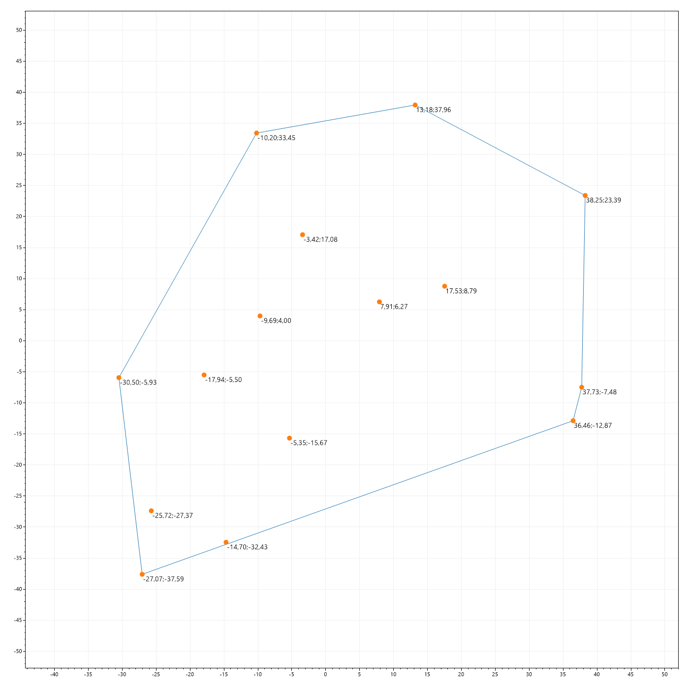
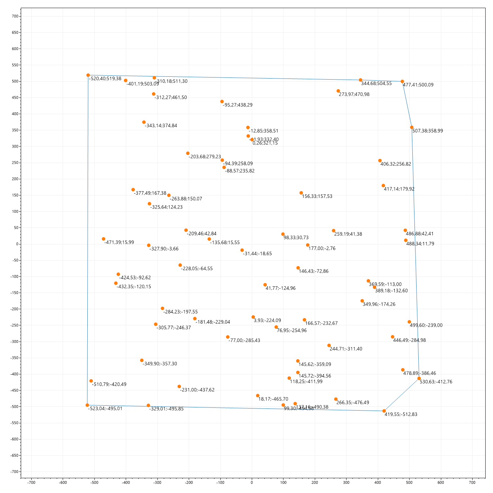
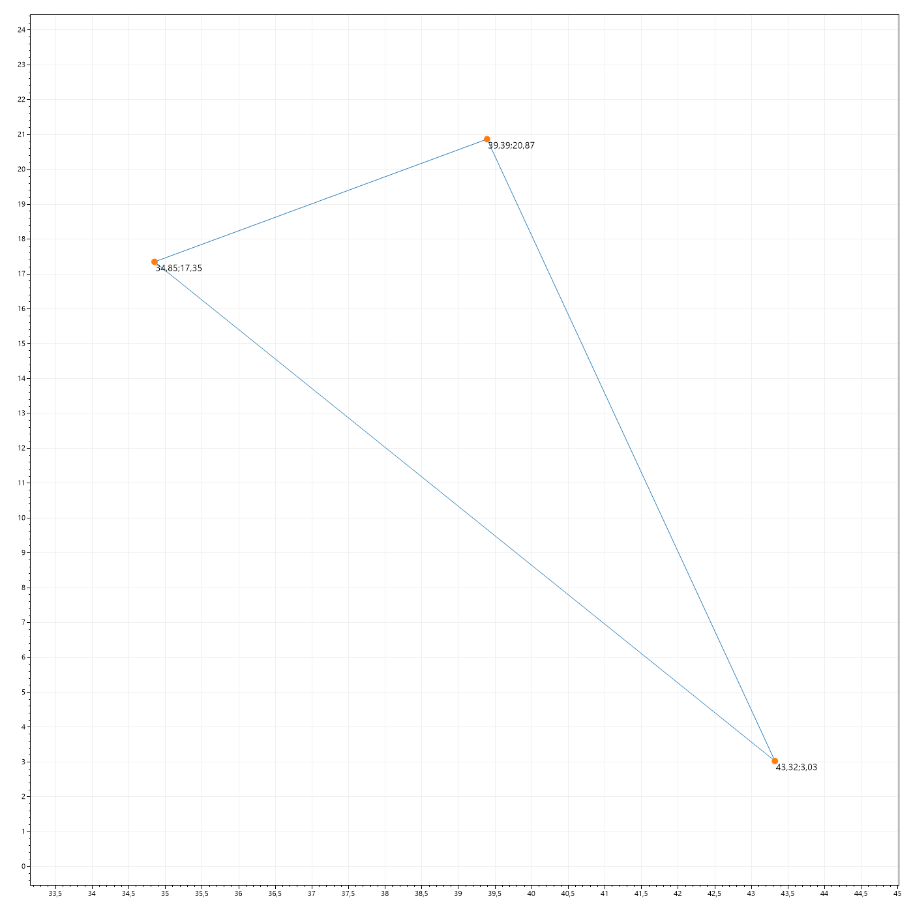
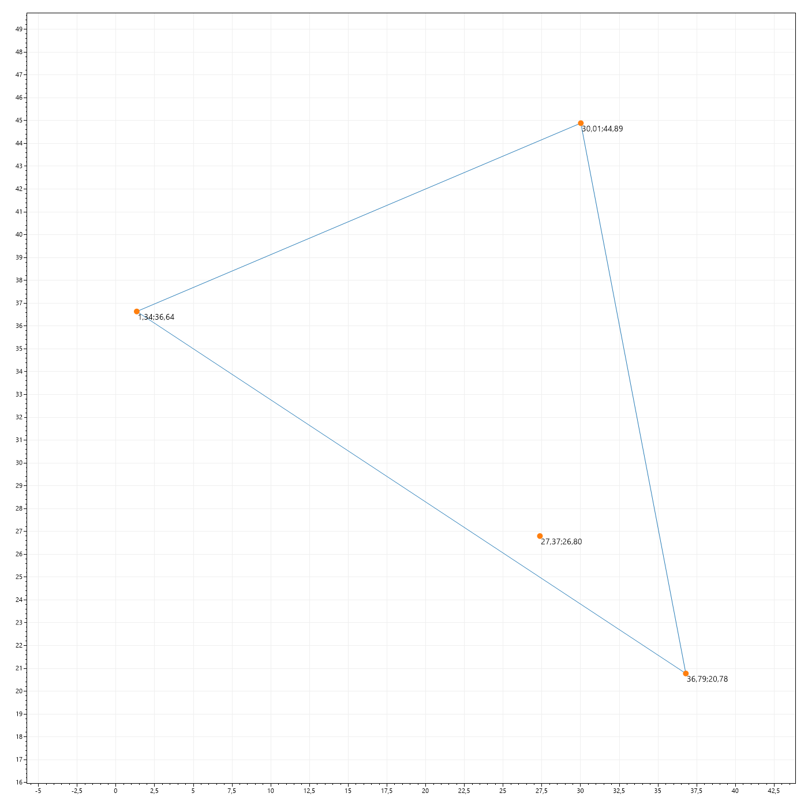

## Опис
### Принцип пошуку паркану з найменшою довжиною

1. Отримання випадково згенерованого масиву "дерев" з координатами. 
2. Визначення діапазону координат в яких лежать всі дерева.
3. Розрахунок початкової точки, яка знаходиться ззовні масиву дерев (нижній лівий кут). Приймаємо цю точку як "нульову", беремо її за відносний початок координат.
4. Знаходимо відстань від "нульової" точки до всіх дерев.
5. Вибираємо дерево яке має меншу відстань до "нульової" точки. Це гарантує, що вибране дерево буде знаходитись на границі масиву дерев і є першою точкою паркану.
6. Лінію, яка з'єднує "нульову" і вибране "перше" дерево, беремо за вісь відліку кута.
7. Знаходимо радіус і кут між "першим" деревом і всіма іншими деревами масиву. Кут розраховується від вісі відліку з пункту 6.
8. Дерево для якого значення кута буде найбільшим - приймаємо як наступну точку паркану "друге" дерево. Лінія яка з'єднує "друге" дерево з "першим" вибираємо як нову вісь відліку кута.
9. Знаходимо радіус і кут між "другим" деревом і всіма іншимим деервами масиву. Кут розраховується від вісі відліку з пункту 8.
10. Цикл працює до моменту доки алгоритм не вийде на "перше" дерево. Що буде означати - кінець пошуку, паркан є замкненою лінією.

Приймаємо умову що паркан можна будувати для саду який має не менше 3х дерев.

#### 1
Кількість точок = 15; Діапазон [-40;40]

#### 2
Кількість точок = 65; Діапазон [-540;540]

#### 3
Кількість точок = 3; Діапазон [0;50]

#### 4
Кількість точок = 4; Діапазон [0;50]
