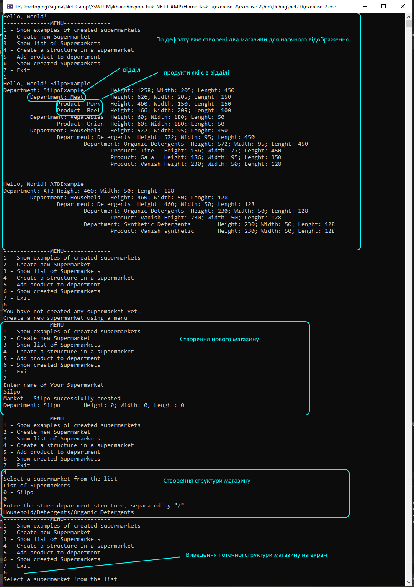
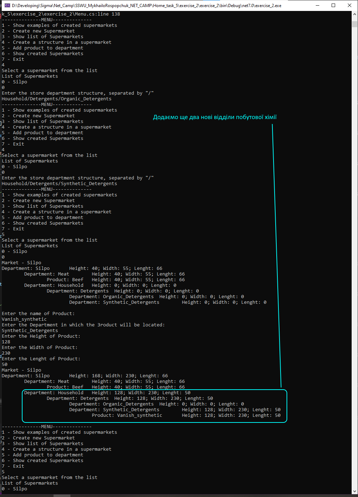

## Опис

Виходячи з того що весь магазин, відділи і продукти розглядаються як один об'єкт - коробка. То для моделювання магазину достатньо йодного класу ```Item```. Структура магазину моделюється вкладенням об'єктів ```Item``` в об'єкт ```Item```. Робота з елементами моделі магазину організована рекурсивними функціями.

```Menu``` - клас використовується для комунікації з юзером, організації основного функціоналу програми.

```GenerateExamples``` - клас призначений для автматичного генерування двох прикладів магазинів, які доступні користувачу для огляду. Зберігаються в класі ```LocalStorage```.

```LocalStorage``` - клас призначений для локаольного тимчасового зберігання екземплярів створених магазинів

### 1


### 2


### 3


### 4


### 5


### 6


### 7


### 8


### 9
