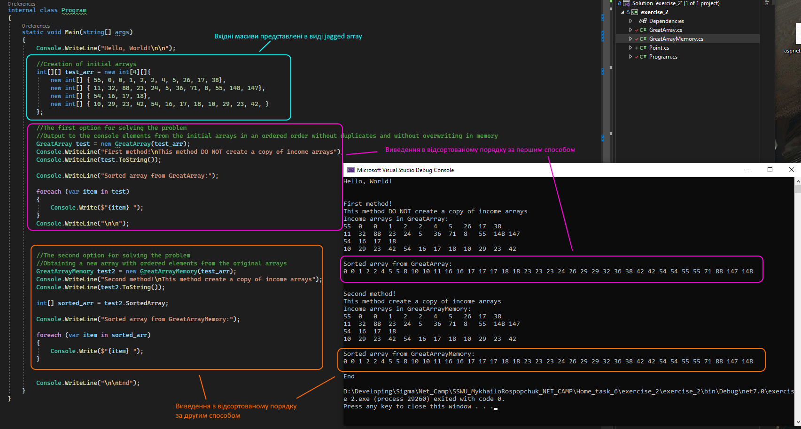

## Solve
Я так до кінця і не зрозумів які саме вимоги до сортування і виведення вхідних масивів. Тому виконав двома способами.

1. Перший спосіб реалізовано класом ```GreatArray```. В цьому класі виведення всіх елементів вхідних масивів виконується без їх копіювання в пам'ять. Задано алгоритм за яким елементи будуть виводитись в консоль в порядку зростання. Без зміни і копіювання вхідних масивів.

    1.1. Для цього знаходимо максимальне і мінімальне значення в вихідних масивах.

    1.2. В першій ітерації зовнішнього циклу знаходимо перше найменше значення. Записуємо його координати в екземпляр класу ```Point```. Повертаємо знайдене значення з допомогою ```yield```.

    1.3. Повторюємо пошук найменшого значення в вхідних масивах. Кожне значення повинно бути більшим або рівним до попередньо повернутого (яке записано в ```Point```). Якщо нове найменше значення має нові координати - повертаємо його з допомогою ```yield``` і додаємо його координати в ```Point```. Якщо нове значення має координати раніше повернутого, воно пропускається.

    1.4. Якщо знайдене нове мінімалне значення не є дублікатом попереднього, то при записі його в ```Point``` старе значення і координати видаляються.

    1.5. Зовнішній цикл повторюється доки знайдене мінімальне значення є меншим за максимальне значення з пункту 1.1. 

2. Другий спосіб ```GreatArrayMemory``` повертає новий масив в якому будуть всі елементи з вхідних масивів відсортовані в порядку зростання.


