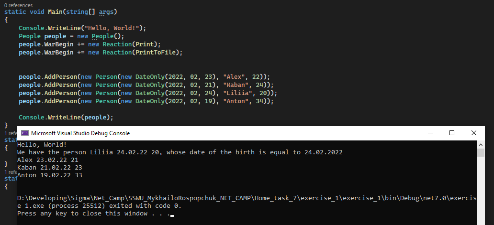

## Problem
Проблема була в двох місцях:
1. Метод додавався до івенту вже після того як створювався екземпляр ```Person```. А властивість ```Age``` ніде не викликалась.
2. В властивості ```Age``` івент викликав себе рекурсивно доки вік не ставав менше 18-ти років.


## Solve
1. Оскільки фактично екземпляр ```Person``` створюється в класі ```Main```, то і додававння методу до івенту треба робити в ```Main``` до кожного екземпляру, що є не дуже зручно і правильно. Тому в класі ```Person``` створено метод ```CheckAge()```, яким і будемо викликати перевірку віку з класу ```People```.
2. Для уникнення рекурсі викликається метод ```CheckAge()```, який перевіряє вік. І якщо вік більше 18-ти років викликає івент ``` DecrementAge.Invoke(this)```. А івент в свою чергу викликає метод ```person.DecreaseAge()```, який і зменшує вік на одиницю безпосередньо через поле ```_age```.

