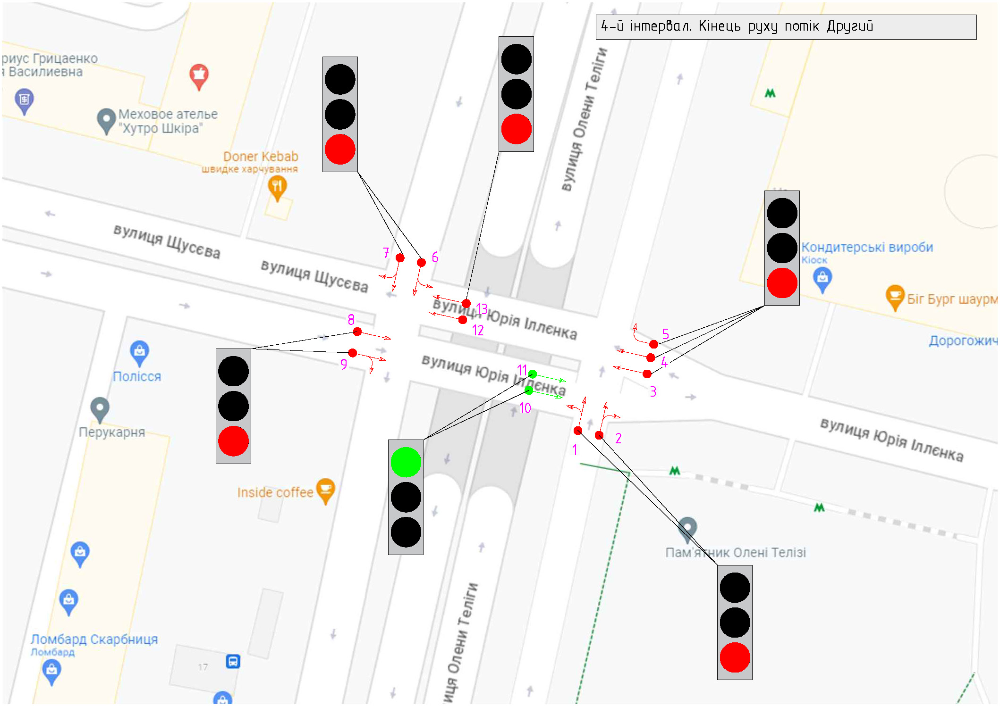

## Опис

В основу розв'язання проблеми закладено патерн Спостерігач. Де світлофори є спостерігачами суб'єкту. А Контроллер є суб'єктом який повідомляє спостерігачів про зміну свого стану відповідно до інтервалу.

## Алгоритм

Для моделювання управління світлофорами і виведення поточного стану світлофорів вирішено виконати в двох потоках.
Перший потік виконує зміну стану світлофорів відповідно до інструкцій які надав користувач.
Другий потік виконує виведення в консоль поточного стану світлофорів. 

Така будова вибрана для можливості демонструвати стан системи з будь якою частотою в будь який момент часу не залежно від швидкості виконання інструкцій. 

## Будова
```interface ITrafficLightObserver``` - інтерфейс який описує світлофор ```TrafficLight``` як спостерігача.

```interface ISubject``` - інтерфейс який описує контроллер ```Controller``` як суб'єкта.

```interface IClonable<T>``` - інтерфейс який описує клонування екземплярів.

```class TrafficLight : ITrafficLightObserver, IClonable<TrafficLight>``` - клас який моделює світлофор як об'єкт. Має в собі метод ```Update``` який викликається суб'єктом ```Controller``` для сповіщення об'єкту про зміну свого остану.

```class TrafficPeriod : IClonable<TrafficPeriod>``` - клас який моделює інструкції яким повинен слідувати ```Controller```. В інструкціях зберігається інформація про стан кожного світлофору в якому він повинен бути, тривалість однієї інструкції (зеленого світла), тривалість жовтого світла. 

```static class View``` - клас який виконує функцію виведення інформації про поточний стан суб'кту в консоль. Містить івент ```ChangingTrafficOrder``` який використовується для виведення інформації про стан виконання поточної інструкції ```TrafficPeriod``` в класі ```Controller```.

```class Controller : ISubject``` - клас який моделює ```Controller``` як суб'єкт. Суть роботи ```Controller``` полягає в пермиканні світлофорів з однієї інструкції на іншу відповідно до часових проміжків. Метод ```Notify``` виконує сповіщення спостерігачів ```TrafficLight``` про зміну стану ```Controller```. Має методи для додавання/видалення піписників ```TrafficLight``` (спостерігачів), приймання інструкцій роботи ```TrafficPeriod```. Метод  ```LightFlow``` виконує бізнеслогіку контроллера і виконує зміну його стану відповідно до інструкцій. Метод ```SendСurrentStatus``` використовується для збору і надсилання даних про поточний стан контроллера на модуль виведення поточного стану в клас ```static class View``` з певним незалежним інтервалом. Метод ```RequestStop``` створений для можливості зупинки процесів в потоках, для їх безпечної зупинки (Abort не рекомендовано використовувати)

```class InitializerCrossroads``` - клас який виконує основну функцію ініціалізації роботи суб'єкту та спостерігачів, введення вхідних даних, приймання тривалості моделювання від користувача, реєстрація івенту ```ChangingTrafficOrder```. В даному класі в методі ```InitializeTraffic``` виконується створення двох потоків виконнання алгоритму:
- ```Thread TrafficFlowThread``` - потік в якому відбувається виконання інструкцій ```TrafficPeriod``` і сповіщення спостерігачів ```TrafficLight``` відповідно до часових проміжків.
- ```Thread SendResultThread``` - потік в якому з вказаною частотою (0,5 секунди) відбувається збір даних про поточний стан суб'єкту. І передача даних в клас ```View``` для вивелдення в кнонсоль.

Також в класі виконано інструмент зупинки виконання процесів в потоках (https://learn.microsoft.com/en-us/dotnet/csharp/language-reference/keywords/volatile).

## Демонстрація роботи
Скріншот результуту

Процес виконання програми


## Приклад перехрестя
Для демонстрації роботи програми вибрано перехрестя біля станції метро Дорогожичі м.Київ (https://goo.gl/maps/Wa5KC4cxVMXb4DAz6).
Перехрестя має 13 світлофорів якщо не рахувати пішохідні. Рух виконується (за моїми припущеннями) в трьох напрямках:
1. З Півдня на Північ - Перший напрям.
2. З Півночі на Південь - Другий напрям.
3. З Сходу на захід і з Заходу на Схід одночасно - Третій напрям.

Інтервали руху задаються наступним чином:

```
({ 1, 1, -1, -1, -1, -1, -1, -1, -1, -1, -1, 1, 1 }, 2, 1),
({ -1, -1, -1, -1, -1, -1, -1, -1, -1, -1, -1, 1, 1 }, 1, 1),
({ -1, -1, -1, -1, -1, 1, 1, -1, -1, 1, 1, -1, -1 }, 2, 1),
({ -1, -1, -1, -1, -1, -1, -1, -1, -1, 1, 1, -1, -1 }, 2, 1),
({ -1, -1, 1, 1, 1, -1, -1, 1, 1, 1, 1, 1, 1 }, 2, 1),
({ -1, -1, -1, -1, -1, -1, -1, -1, -1, 1, 1, 1, 1 }, 2, 1)
```
Масив з 13-ти елементів -1 або 1 - показує стан світлофору в даний момент (-1 = Red, 1 = Green). Перше число після масиву вказує тривалість інтервалу. Друге число вказує тривалість перемикання жовтого кольору.





