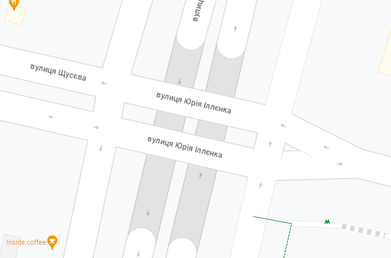
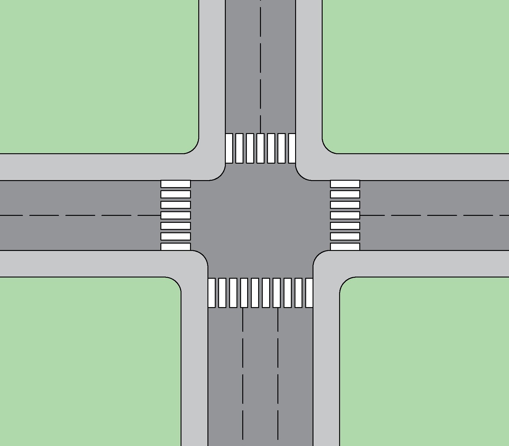
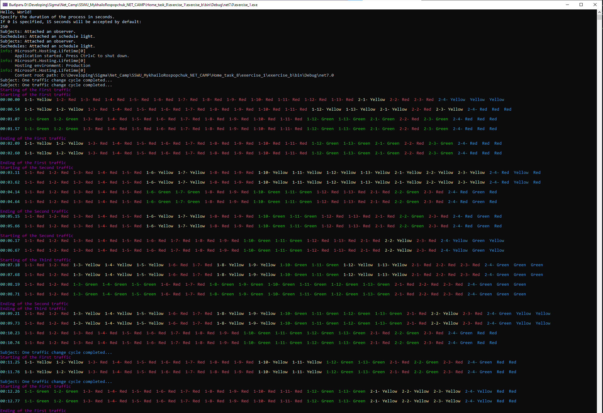

## Опис

Для виконання 8-ї Домашньої роботи внесено зміни в консольний додаток який був створений в 7-й Домашній роботі. 

Основні зміни відбулись в класах:
- ```class InitializerCrossroads```,
- ```class Controller : ISubject```,
- ```class TrafficLight : ITrafficLightObserver, IClonable<TrafficLight>```,
- ```static class View```

1. ```class InitializerCrossroads```:
 - виконанно механізм створення множини світлофорів перехресть відповідно до внесених інструкцій - метод ```CrossroadsGenerator```;
 - виконанно механізм створення множини контролерів відповідно до створеної множини світлофорів - метод ```ControllerGenerator```;
 - для кожного сонтролера виконується створення, запуск і зупинка окремого потоку методами - ```ThreadGenerator```, ```StartThreads``` i ```StopThreads```  відповідно.

Для кожного перехрестя інструкції задаються окремим списком.

2. ```class Controller : ISubject```:
- в попередній версії функцію викилику класу ```static class View``` виконував клас контролера. Цю функцію прибрано з даного класу, оскільки при множині перехресть збір інформації з кожног освітлофора викликає труднощі в синхронізації потоків. Механізм збору інформації про поточний стан кожног освітлофора виконується в ноствореному класі ```class DataColector```.

3. ```class TrafficLight : ITrafficLightObserver, IClonable<TrafficLight>```:
- реалізовано можливість вказати тип світлфоора і відповідно до типу визанчається його можливий стан (1 - звичайний світлфоор, 2 - світлфор з додатковими ліхтарями).
- змінено метод ```Update``` для реалізації перемикання стану світлфоора як для першого випадку (1, 2 або 3). Другий випадок - коли стан задається тризначним числом в якому кожен знак може бути 1, 2 або 3 і відповідно зліва направо відповідає за зміну конкретної секції світлофору (ліва, центральна - де три сигнали, права).

4. ```static class View```:
- змінено метод виведення ```PrintState```, адаптовано для відповідного виведення в консоль кольору світлофору за його типом.

### Збір і обробка даних про поточний стан світлофорів

```class DataColector``` - збирання даних про поточний стан кожного світлофору на всіх перехрестях реалізовано в даному класі. Процес виконується в окремому потоці від потоків контролерів ```class Controller : ISubject```. В методі ```Collector``` зібрані поточні дані передаються в ```static class View``` для виведення інформації на консоль, і також дані перезаписуються в ```static class DataHandler```, який зберігає дані про поточний стан.

```static class DataHandler``` - виконує механізм короткочасного зберігання даних про поточний стан світлофорів форматі який предається на клієнт ```|{_id}:{_number}:{_type}:{_state}```. Де ```_id``` - номер перехрестя, ```_number``` - номер світлофора своєму на перехресті, ```_type``` - тип світлофору 1 або 2. ```_state``` - поточний стан, в залежності від типу світлофору - однозначне або тризнчен число.

## Реалізація візуалізації

Для реалізаці візуалізації виконання симуляції роботи світлофорів - створено окремий WPF додаток.
Передача інформації про поточний стан світлофорів, від консольного до WPF додатку реалізовано за допомогою ```NamedPipeServerStream``` (https://learn.microsoft.com/en-us/dotnet/standard/io/how-to-use-anonymous-pipes-for-local-interprocess-communication). Де консольний додаток виступає сервером а WPF - клієнтом. Відправка даних на клієнт відбувається кожні 0,5 сек.

Створено два класи:
- ```static class ServerServices``` - запускає хост на стороні сервера;
- ```class Worker : BackgroundService``` - реалізує надсилання даних на клієнт. Дані зчитує з класу ```static class DataHandler```;

## Алгоритм

Оскільки кількість перехресть може бути будь-яка - реалізація перемикань стану світлофорів виконується для кожного перехрестя в окремому потоку.

Окремий потік виконує збір інформації про поточний стан світлофорів, після чого перенаправляє дані для вивоедення в консоль і окремо записує поточний стан в ```static class DataHandler``` з якого дані відправляються на клієнт.

## Приклад перехрестя
Для демонстрації роботи програми вибрано два перехрестя. 

Перше - біля станції метро Дорогожичі м.Київ (https://goo.gl/maps/Wa5KC4cxVMXb4DAz6).


Перехрестя має 13 світлофорів якщо не рахувати пішохідні. Рух виконується (за моїми припущеннями) в трьох напрямках:
1. З Півдня на Північ - Перший напрям.
2. З Півночі на Південь - Другий напрям.
3. З Сходу на захід і з Заходу на Схід одночасно - Третій напрям.

Друге перехрестя уявне. Друге - має 3 звичайні світлфори і один світлофор другого типу.




Інтервали руху задаються наступним чином для кожного перехрестя:
```
List<TrafficPeriod> schedule_light_first = new List<TrafficPeriod>()
{
    new TrafficPeriod(new int[] { 3, 3, 1, 1, 1, 1, 1, 1, 1, 1, 1, 3, 3 }, 2, 1),
    new TrafficPeriod(new int[] { 1, 1, 1, 1, 1, 1, 1, 1, 1, 1, 1, 3, 3 }, 1, 1),
    new TrafficPeriod(new int[] { 1, 1, 1, 1, 1, 3, 3, 1, 1, 3, 3, 1, 1 }, 2, 1),
    new TrafficPeriod(new int[] { 1, 1, 1, 1, 1, 1, 1, 1, 1, 3, 3, 1, 1 }, 2, 1),
    new TrafficPeriod(new int[] { 1, 1, 3, 3, 3, 1, 1, 3, 3, 3, 3, 3, 3 }, 2, 1),
    new TrafficPeriod(new int[] { 1, 1, 1, 1, 1, 1, 1, 1, 1, 3, 3, 3, 3 }, 2, 1)
};
List<TrafficPeriod> schedule_light_second = new List<TrafficPeriod>()
{
    new TrafficPeriod(new int[] { 3, 1, 3, 111 }, 3, 1),
    new TrafficPeriod(new int[] { 1, 3, 1, 131 }, 3, 1),
    new TrafficPeriod(new int[] { 1, 1, 1, 333 }, 3, 1),
    new TrafficPeriod(new int[] { 1, 3, 1, 311 }, 3, 1),
};
```
Масив з 13-ти елементів 1 або 3 - показує стан світлофору в даний момент (1 = Red, 3 = Green). Перше число після масиву вказує тривалість інтервалу. Друге число вказує тривалість перемикання жовтого кольору. У випадку використання світлофора другого типу (з боковими вказівниками) стан світлофора задається в форматі тризначного числа X1X2X3 - де Х1 - стан лівого вказівника, Х2 - стан середнього вказівника, Х3 - стан правого вказівника. Для кожного вказівника 1 = Red і 3 = Green.

Окремо вказується для кожного перехрестя тип кожного світлофору
```
List<int[]> traffic_lights_types = new List<int[]>()
{
    new int[] {1, 1, 1, 1, 1, 1, 1, 1, 1, 1, 1, 1, 1},
    new int[] {1, 1, 1, 2}
};
```


## Демонстрація роботи
Скріншот результуту

Процес виконання програми

Виведення в консоль і в WPF
