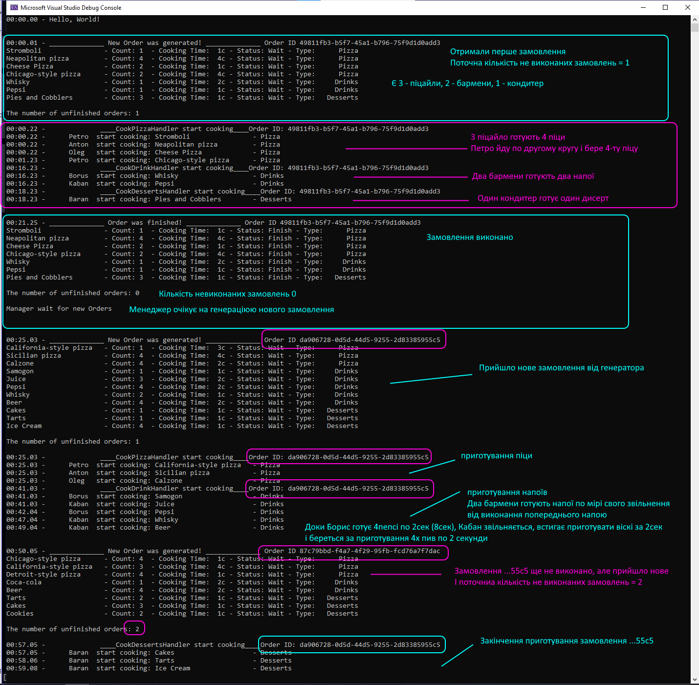
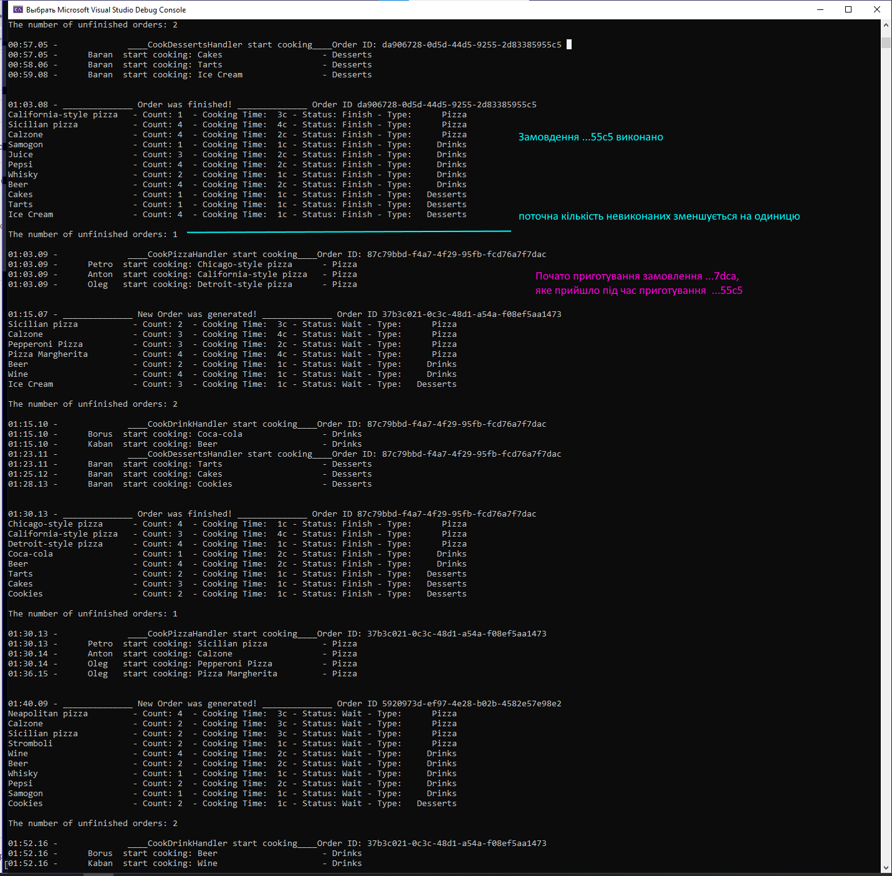

## Знаю що дедлайн був 22.05. По своїй неуважності вирішив чомусь, що дедлайн зсунули на 24.05. Тому, нажаль, маємо те, що маємо...

## Алгоритм

Ланцюг складається з трьох ланок: 
- приготування піци (3 кухарі)
- приготування напоїв (2 кухарі)
- приготування дисертів (1 кухар)

Ланцюг обов'язків приймає замовлення, яке складається з старав в обробку. Замволення проходить поступово від одного ланцюга до наступного. 

Одночасно в ланцюгу може бути одне замовлення.

Замовлення генеруються випадковим чином з списку страв. Частота генерації може бути сталою або випадковою.

При отриманні нового замовлення до того як попереднє не виконано, нове замовлення ставиться в чергу.

Менеджер видає замовлення в виконання відповідно до черги.

Якщо в замовленні страви одного виду більше ніж кухарів - то кухар бере в роботу нову старву з замовлення, по мірі свого звільнення від виконання попередньої.

## Вивід в консоль (інтервал генерування замовлення 25 с.)
Час приготування страви в замовленні вказано на 1 одиницю страви.

